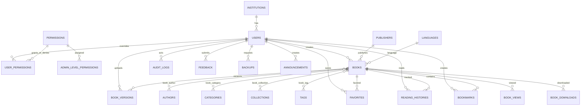

# E-PERPUSTAKAAN DIGITAL KPU — Architecture

## 1. Ringkasan arsitektur

The system is a modular Laravel monolith. HTTP controllers and Livewire components are
thin adapters; domain services own workflows such as authorization, publication,
private document delivery, PDF processing, analytics, audit, and backup. Public pages
are server-rendered for SEO and resilient cPanel operation. AJAX endpoints are RESTful
and protected with validation, throttling, policies, and consistent JSON responses.

The database is the source of truth. Original PDFs live on private storage and are only
served through authorized, expiring routes. Expensive PDF work runs on queues. Cache is
used for catalog metadata and aggregate statistics, never as the sole copy of data.

## 2. Modul

| Module | Responsibilities |
|---|---|
| Identity | Login, registration switch, verification, password reset, profile, 2FA boundary |
| Authorization | role/admin level validation, granular permission resolution, middleware, gates, policies |
| Catalog | books, authors, publishers, languages, tags, categories, collections |
| Content Workflow | draft, review, rejection notes, schedule, publish, archive, versions |
| PDF Processing | validation, private storage, extraction, thumbnail, optimization, queue status |
| Public Portal | home, catalog, shelves, categories, details, SEO, sitemap |
| Reader | PDF.js, page flip, scroll fallback, lazy pages, bookmarks, last page |
| Member Library | favorites, personal collections, histories, subscriptions, notifications |
| Search | metadata search, filters, autocomplete, logs, OCR/full-text extension boundary |
| Analytics | privacy-preserving views, downloads, duration, aggregates, exports |
| Governance | immutable audit events, feedback/report handling, settings, announcements |
| Operations | backups, scheduler, storage health, PWA, embed allowlist, maintenance mode |

## 3. ERD



## 4. Struktur folder target

```text
app/
├── Domain/
│   ├── Authorization/  ├── Books/       ├── Documents/
│   ├── Publishing/     ├── Reader/      ├── Search/
│   ├── Analytics/      ├── Audit/       └── Backup/
├── Http/
│   ├── Controllers/    ├── Middleware/  ├── Requests/  └── Resources/
├── Livewire/
│   ├── Public/         ├── Member/      └── Admin/
├── Models/             ├── Policies/    ├── Jobs/      └── Providers/
database/
├── factories/          ├── migrations/  └── seeders/
resources/
├── css/                ├── js/          └── views/
│   ├── components/     ├── layouts/     ├── public/    ├── member/ └── admin/
routes/
├── web.php             ├── api.php      ├── console.php └── channels.php
tests/
├── Feature/            └── Unit/
docs/
├── ARCHITECTURE.md     ├── CPANEL.md     └── MANUAL_TESTING.md
```

## 5. Route map

### Public web

`/`, `/katalog`, `/cari`, `/rak/{collection:slug}`, `/kategori/{category:slug}`,
`/buku/{book:slug}`, `/buku/{book:slug}/baca`, `/buku/{book:slug}/unduh`,
`/terbaru`, `/terpopuler`, `/tentang`, `/panduan`, `/kontak`, `/privasi`,
`/embed/buku/{book:slug}`, `/embed/rak/{collection:slug}`,
`/embed/kategori/{category:slug}`.

### Authentication and member

`/login`, `/register` (setting-controlled), `/forgot-password`, `/verify-email`,
`/profil`, `/favorit`, `/riwayat-baca`, `/bookmark`, `/koleksi-saya`, `/langganan`,
`/notifikasi`, `/akun`, `/two-factor/setup`, dan `/two-factor/challenge`.

### Admin web

`/admin`, `/admin/books`, `/admin/books/{book}/submit|return|publish|archive`,
`/admin/collections`, `/admin/categories`, `/admin/users`,
`/admin/users/{user}/permissions`, `/admin/statistics`, `/admin/feedback`,
`/admin/audit-logs`, `/admin/backups`, dan `/admin/settings`.

### REST/AJAX

`GET /api/search/suggestions`, `POST /api/books/{book}/view`,
`PUT /api/member/books/{book}/progress`, `PUT|DELETE /api/member/books/{book}/favorite`,
dan `POST|DELETE /api/member/books/{book}/bookmarks[/{page}]`.

## 6. Daftar tabel

Core identity: `users`, `institutions`, `permissions`,
`admin_level_permissions`, `user_permissions`.

Catalog: `books`, `book_versions`, `book_reviews`, `categories`, `book_category`, `collections`,
`book_collection`, `authors`, `book_author`, `publishers`, `tags`, `book_tag`,
`languages`.

Member and activity: `favorites`, `reading_histories`, `bookmarks`, `personal_collections`,
`personal_collection_books`, `category_subscriptions`, `notifications`, `book_views`,
`book_downloads`, `search_logs`.

Governance and operations: `feedback`, `announcements`, `audit_logs`, `backups`,
`settings`, plus Laravel framework tables for sessions, cache, jobs, notifications,
password resets, and failed jobs.

The generic `roles`, `role_permissions`, and `user_roles` names in the older PRD are
intentionally normalized to the user's later authoritative model: three fixed roles,
four admin levels, `admin_level_permissions`, and `user_permissions`.

## 7. Tahapan pengerjaan

1. Foundation: architecture, migrations, authentication, permission resolution.
2. Content administration: book metadata, taxonomy, collection, PDF upload, dashboard.
3. Public portal: home, catalog, search/filter, book detail.
4. Reader: PDF.js, lazy flipbook/scroll, bookmark, sharing, QR, permission delivery.
5. Governance: analytics, immutable audit, backup, feedback, exports.
6. Hardening: complete test matrix, performance, security, accessibility, docs, deployment.

Each stage ends with a fresh-database migration, targeted tests, full test suite, asset
build, and application boot smoke test.

## 8. Risiko teknis

- Ghostscript/ImageMagick/Poppler may be unavailable on shared hosting. Processing is
  adapter-based and can run on a worker-capable host while the application remains usable.
- Long queue workers are commonly prohibited on cPanel. Database jobs therefore support
  short `queue:work --stop-when-empty` cron invocations.
- Large PDFs can exhaust browser/server memory. Rendering and server processing are chunked.
- Private PDF streaming must support range requests without exposing physical paths.
- Publication status and visibility are orthogonal; policies centralize combinations.
- Analytics must deduplicate without retaining unnecessary visitor identity.
- Audit rows require application and database protections against update/delete.

## 9. Strategi optimasi PDF

1. Validate extension, MIME signature, configured size, and parseability.
2. Generate a UUID storage name; retain the sanitized original name as metadata only.
3. Store original on a private disk and calculate SHA-256.
4. Commit metadata and dispatch an idempotent processing job after transaction commit.
5. Extract page count and PDF outline once.
6. Generate responsive WebP cover/thumbnail derivatives from page one.
7. Produce an optimized PDF using a configurable adapter; never replace the original.
8. Record processing state and actionable error details.
9. Reader requests the PDF only after entering reader and renders nearby pages lazily.
10. Cache rendered canvases with a small eviction window; mobile defaults to one-page/scroll.

## 10. Strategi deployment cPanel

- Place the Laravel project outside `public_html`, for example `~/apps/eperpustakaan`.
- Copy/symlink only Laravel `public/` contents into a chosen domain document root.
- Adjust `index.php` paths to `vendor/autoload.php` and `bootstrap/app.php` outside web root.
- Build Vite assets locally/CI and upload `public/build`; Node is not required at runtime.
- Use PHP 8.3+, required extensions, MySQL/MariaDB, and private writable storage.
- Run `artisan storage:link` only for approved public derivatives; originals stay private.
- Run scheduler every minute; use database queue with a bounded cron worker when Supervisor
  is unavailable.
- Cache production config/routes/views after environment validation.
- Back up DB, private documents, and configuration separately; restore is superadmin-only.
